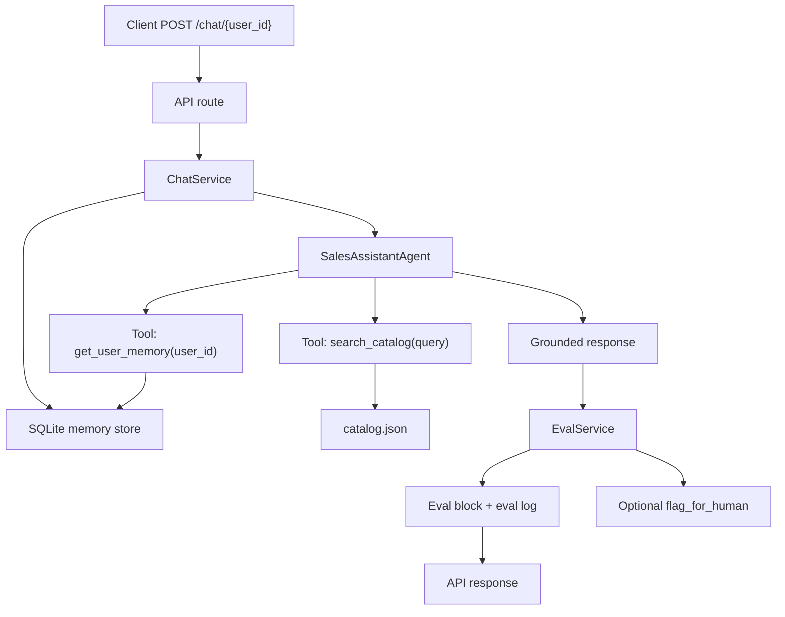

# Persistent Sales Assistant Agent

A FastAPI backend for a persistent B2B sales assistant. The agent answers questions from a mock SaaS catalog, remembers each user's interests across separate API calls, calls real tools, and returns a structured self-evaluation block on every chat response.

## Live URL

Railway URL: `https://YOUR-RAILWAY-APP.up.railway.app`

Replace this with the final Railway deployment URL before submission.

## Features

- `POST /chat/{user_id}` sends a message and returns an answer, eval block, tools called, and session id.
- `GET /chat/{user_id}/history` returns all stored user and assistant messages across sessions.
- `DELETE /chat/{user_id}/memory` deletes messages, memory facts, evals, and human-review flags for a user.
- `GET /catalog` returns the SaaS pricing/features catalog used by the agent.
- `GET /health` checks service health.
- `GET /chat/{user_id}/evals` returns aggregate eval metrics for a user.

## Architecture



The route handlers stay thin. `ChatService` owns orchestration, `SalesAssistantAgent` owns tool use and response composition, `memory/` abstracts persistence, and `tools/` contains portable callable functions.

## Memory Design

Memory is stored in SQLite through `SqlAlchemyMemoryStore`, which implements the `MemoryStore` abstraction. The app stores:

- Full conversation messages in `conversation_messages`
- Extracted user memory facts in `user_memory_facts`
- Structured response evaluations in `response_evals`
- Low-confidence review flags in `human_flags`

SQLite is enough for the assignment because it proves durable cross-session memory without infrastructure overhead. At scale, I would swap `SqlAlchemyMemoryStore` to Postgres for transactional storage and add a vector memory backend such as pgvector, Pinecone, or Mem0 for semantic retrieval. Because the API, tools, and agent depend on `MemoryStore` instead of raw database queries, that change is isolated to the memory layer.

## Tool Use

The agent uses real callable tools:

- `search_catalog(query)` loads and searches `catalog.json` by plan names, prices, features, add-ons, and use cases.
- `get_user_memory(user_id, query, memory_store)` retrieves relevant persisted facts from the database.
- `flag_for_human(user_id, session_id, reason, db)` logs low-confidence responses for review.

The assistant does not answer from generic LLM knowledge. It composes responses from catalog results and stored user context.

## Eval Design

Every chat response includes:

```json
{
  "eval": {
    "groundedness": 0.95,
    "relevance": 0.88,
    "confidence": 0.85,
    "flagged": false,
    "reasoning": "Response is grounded in catalog results and uses stored user context."
  }
}
```

The current evaluator is deterministic and transparent: it scores catalog grounding, response relevance to the user question, and whether stored context was applied. This is reliable for a small mock catalog and keeps the demo easy to run without external API keys. In production, I would replace or augment it with a separate evaluator model, citation checks against retrieved catalog snippets, and offline eval sets for known sales questions.

## Run Locally

```bash
python -m venv .venv
.venv\Scripts\activate
pip install -r requirements.txt
uvicorn app.main:app --reload
```

Open:

- API docs: `http://127.0.0.1:8000/docs`
- Health check: `http://127.0.0.1:8000/health`

## Cross-Session Memory Demo

Call 1 stores the user's interest in Enterprise pricing:

```bash
curl -X POST "http://127.0.0.1:8000/chat/demo-user" \
  -H "Content-Type: application/json" \
  -d "{\"message\":\"What's your enterprise pricing?\"}"
```

Call 2 is a separate request with no prior context in the payload. The backend remembers Enterprise from SQLite and answers the follow-up:

```bash
curl -X POST "http://127.0.0.1:8000/chat/demo-user" \
  -H "Content-Type: application/json" \
  -d "{\"message\":\"Does that include SSO?\"}"
```

Expected second response includes wording like:

```json
{
  "response": "Since you were asking about Enterprise earlier, Enterprise is $499/mo and includes unlimited users, SSO, audit logs, SLA.",
  "tools_called": ["get_user_memory", "search_catalog"]
}
```

After deploying, replace `http://127.0.0.1:8000` with your Railway URL in both curl commands.

## Railway Deployment

1. Push this repo to GitHub.
2. Go to Railway and choose **New Project -> Deploy from GitHub repo**.
3. Select this repository.
4. Railway will use `railway.json` / `Procfile` and run:

```bash
uvicorn app.main:app --host 0.0.0.0 --port $PORT
```

5. Add these environment variables if needed:

```bash
DATABASE_URL=sqlite:///./data/sales_assistant.db
CONFIDENCE_FLAG_THRESHOLD=0.55
```

